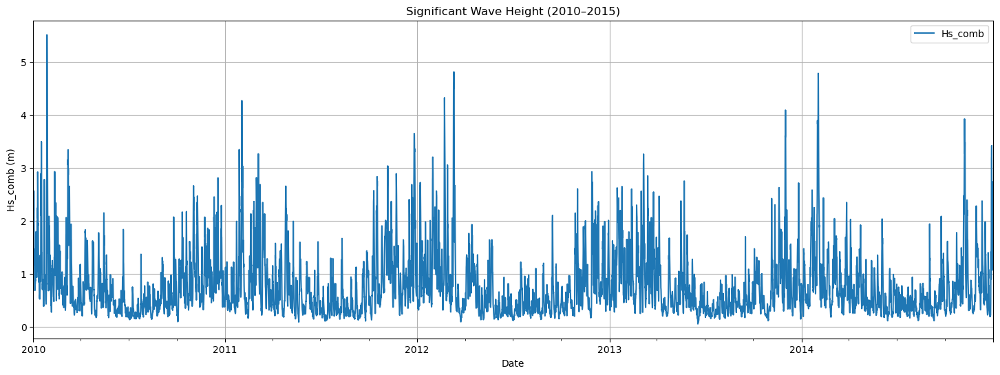
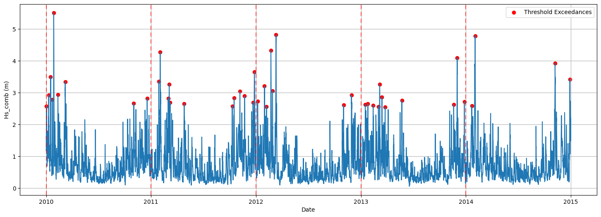
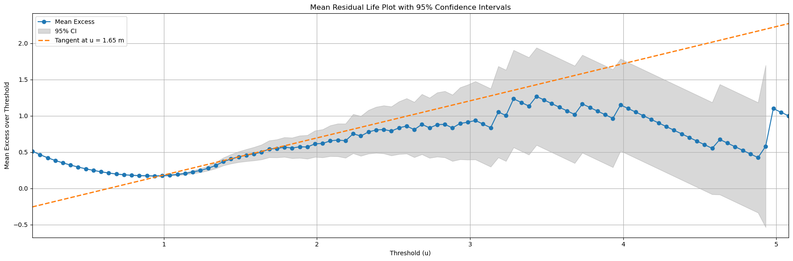

# Sampling Techniques

> Why do we need sampling techniques for extremes?

In the previous section, you have seen the basic concepts needed to address Extreme Value Analysis (EVA), such as what is an extreme observation or the return period ($RT$). Here, we will start the former EVA by presenting the sampling techniques for extremes. In order to illustrate it, we will use a case study: a breakwater design. Note that this procedure can be extrapolated to any loading variable.

Breakwaters are structures which protect the basins of ports and have to withstand wave storms. Thus, the main loading is the significant wave height ($H_s$) and we need to determine $H_s$ for a given $RT$, for instance $RT = 100 \ \text{years}$. For our case of study, we are going to use a time series of recorded by a buoy in the Mediterranean sea. In such buoy, we have 19 years of 3-hourly recordings. In the image below, five of those years are plotted.

## How to select extreme observations within the timeseries?

Two methods are explained in this book to obtain extreme observations within a timeseries. The methods that are explained are:

- **Block maxima (BM)**
- **Peak Over Threshold (POT)**

## Block Maxima (BM)

Block maxima consists of defining a time block, for instance a year, and selecting the maximum observation within that time block. Thus, the number of sampled extremes would be equal to the number of blocks.

Let’s apply it to our time series. We are going to use a block = 1 year, so we will obtain 19 extreme observations for the subsequent phases of our analysis. In the figure below, you can see how the application of this method looks.

:::{tip} Block Maxima

Advantages:

- Easy to guarantee that sampled extremes are *iid* (Independent and Identically Distributed).
- Simple implementation

Disadvantages:
- Only one observation per block, so we may be neglecting extreme observations located within the same time block.
- Not appropriate for short time series.
  
:::

## Peak Over Threshold (POT)

The second technique for sampling extremes is Peak Over Threshold (POT). This technique consists of selecting the excesses over a defined threshold with a minimum distance between them. Thus, it involves defining two parameters: the threshold, and the declustering time (minimum time/distance between two extreme observations). Note that when performing EVA with POT, we model the excesses over the threshold, not the actual value of the extreme event.

When applying this method to the same timeseries, using a threshold $th=2.5 \ m$, and a declustering time $dl = 48h$. The following extreme events are extracted:

As can be seen, a lot more extreme events are extracted than using the Block Maxima method. 

:::{tip} Peak Over Threshold

Advantages:

- Usually a higher number of sampled extremes. Thus, it is appropriate for shorter time series.
- Appropriate when there’s no clear seasonality in the extremes (physical insight in the phenomenom).

Disadvantages:

- Further analysis required to ensure that the sampled extremes are *iid*.
- Further computations needed, so the process is slower.
  
:::

### Extra: How to select an appropriate threshold $th$ and declustering time $dl$?

Choosing $th$ and $dl$ should combine statistical tools with physical insight into the process you are studying.

**Declustering time $dl$**

The declustering time represents the typical duration of a single physical event (for example, a storm). All peaks that occur within one event are assumed to belong to the same cluster and should not be treated as independent extremes.

A practical procedure is:
	•	Use offshore experience or literature to estimate the usual duration of energetic events (for instance, storm length or swell group duration).
	•	Support this with data analysis, such as examining autocorrelation or visually inspecting storms in the time series.
	•	Set $dl$ slightly longer than this characteristic duration, so that two exceedances separated by more than dl are likely to belong to different, independent events.

**Threshold $th$**

A common way to select the threshold th for POT is the mean residual life (MRL), or mean excess, plot. For a candidate threshold u, the mean residual life is defined as

$e(u) = \mathbb{E}[X - u \mid X > u]$,

that is, the expected exceedance above u, given that X is larger than u.

If the excesses above a high threshold follow a Generalised Pareto Distribution (GPD), the function e(u) should be approximately linear for sufficiently large u.

Procedure:
1.	Choose a range of candidate thresholds u in the upper tail of the data.
2.	For each u, compute the sample mean excess
$\hat{e}(u) = \frac{1}{n_u} \sum_{i: X_i > u} (X_i - u)$,
where $n_u$ is the number of observations with $X_i > u$.
3.	Plot $\hat{e}(u)$ against $u$. This is the mean residual life plot.
4.	Identify the region where the plot is approximately linear and still based on a reasonable number of exceedances.
5.	Select $th$ within this approximately linear region.

In practice, the choice of $th$ is a compromise: a higher threshold improves the asymptotic GPD approximation, whereas a lower threshold provides more data points for estimation.

An example of a MRL plot is shown below, with a line indicating the linear relation. 

:::{note} What does the graph show?

In the figure, the blue line shows the sample mean excess for a range of thresholds u. Where this curve is roughly straight, the Generalised Pareto approximation is more appropriate, so the threshold should be chosen in that “almost linear” region. The grey shaded band is the 95% confidence interval (CI) of the mean excess: it gives a range of values that, under repeated sampling, would contain the true mean excess about 95% of the time.

For low to moderate thresholds the CI is relatively narrow, which means the estimate of the mean excess is quite precise. As the threshold increases, fewer data exceed it, so the CI widens and the blue curve becomes noisy.

If you choose a threshold in a region with a large confidence interval, the POT model will be based on very few exceedances. This leads to unstable parameter estimates, larger uncertainty in return levels, and a higher risk that the fitted tail behaviour is not representative of the underlying process. In practice, it is better to select th where the mean excess plot is approximately linear and the confidence interval is still reasonably narrow.

:::

