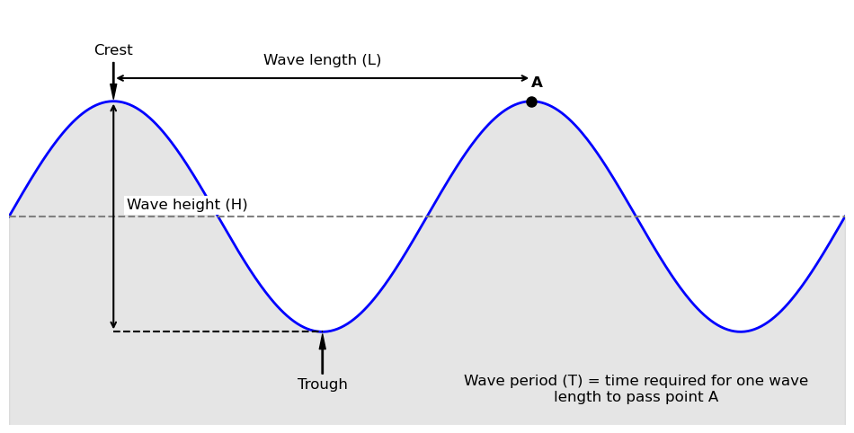

# Waves

When designing floating and submerged tunnels, a thorough understanding of the surrounding environmental conditions is crucial. Among the most significant of these are the wave conditions, which can exert considerable forces on the structures. This section delves into key wave parameters (Significant Wave Height $H_s$ and Peak Period $T_p$) and a spectral model used to characterize the sea state (JONSWAP spectrum).

## Significant Wave Height ($H_s$)

The significant wave height, denoted as Hs or $H_s$, is a fundamental parameter used to characterize the sea state. It is traditionally defined as the average height of the highest one-third of waves in a given time period. This statistical measure was originally developed to align with the wave height a trained observer would visually estimate when characterizing the sea.

### Why use significant wave height instead of the average?

While the average wave height considers all waves, the significant wave height provides a more realistic representation of the sea's impactful energy. Larger waves are of greater concern for the design and safety of hydraulic structures as they carry significantly more energy and exert greater forces. By focusing on the highest third of the waves, the significant wave height effectively captures the more powerful and potentially damaging portion of the wave spectrum. It's important to note that individual waves can be much higher than the significant wave height. For instance, the highest 10% of waves can be 25-30% higher than $H_s$, and occasionally, a wave can be nearly twice the significant wave height.

## Peak Period ($T_p$)

The peak period ($T_p$) is another critical parameter in describing wave conditions. It represents the period of the waves that carry the most energy. In simpler terms, it's the time it takes for two successive crests of the most energetic waves to pass a fixed point.

### Why are longer periods more impactful for larger structures?

Longer wave periods are particularly impactful for large structures like floating and submerged tunnels for several key reasons:
- **Resonance:** Every structure has a natural frequency at which it will oscillate with maximum amplitude. If the peak period of the waves is close to the natural period of the structure, resonance can occur, leading to dangerously large motions and potentially catastrophic failure.jupt
- **Deeper Influence:** The energy of longer period waves penetrates deeper into the water column. This means that even submerged tunnels, which are less affected by shorter, surface waves, will experience significant forces from long-period swell.
- **Greater Energy Content:** The peak period is associated with the most energetic waves in the sea state. Longer period waves, often referred to as swell, have traveled long distances and have accumulated significant energy.

## JONSWAP Spectrum

To fully characterize a sea state, it is not enough to know just the significant wave height and peak period. The distribution of wave energy across a range of frequencies is also crucial. The JONSWAP (Joint North Sea Wave Project) spectrum is a widely used mathematical model that describes this energy distribution. The JONSWAP spectrum is an empirical model developed from data collected in the North Sea. It is particularly well-suited for describing "fetch-limited" seas, which are seas where the waves are still growing and have not reached a fully developed state. This is often the case in coastal areas and semi-enclosed seas where the distance over which the wind blows (the fetch) is limited.

The JONSWAP spectrum is a modification of the earlier Pierson-Moskowitz spectrum, which was developed for fully developed seas. The key difference is the inclusion of a "peak enhancement factor" ($\gamma$) in the JONSWAP model. This factor creates a more peaked and narrower spectrum compared to the Pierson-Moskowitz, which is more representative of the wave conditions observed in developing seas. The sharpness of this peak is important for understanding the potential for resonant interactions with structures.

### How to go from the JONSWAP spectrum to a timeseries?

The JONSWAP spectrum provides the statistical distribution of energy, but for time-domain simulations (such as analysing the motion of a floating and submerged tunnel using Finite Element Method), a wave elevation profile $\eta(t)$ is needed. To create this time series, the sea state is treated as a sum of simple, regular sine waves, each with a different frequency and amplitude. 

**1. Discretizing the Spectrum**

First, the continuous energy spectrum $S(f)$ is divided into $N$ frequency band, each with a width of $\Delta f$. For each band $i$, the central frequency is $f_i$. 

**2. Calculating Wave Amplitudes**

The area onder the spectrum curve for a specific frequency band represents the energy of the waves at that frequency. The amplitude $A_i$ of each component wave is derived from this energy. 

$$
\text{Energy}_i = S(f_i) \cdot \Delta f = \frac{1}{2} {A_i}^2 \longrightarrow A_i = \sqrt{2 \cdot S{f_i} \cdot \Delta f}
$$

**3. Applying Random Phases**

If all waves with amplitude $A_i$ would be added together with the same starting point, they would peak simultaneously, creating an uncrealistically focussed wave. Real oceans have random phase relationships. To simulate this, a random phase angle $\phi_i$ is applied to each component, chosen from a uniform distribution between $0$ and $2 \pi$. 

**4. Superposition (Summation)**

Finally, all individual wave components are summed to construct the total surface elevation $\eta(t)$:

$$
\eta(t) = \sum_{i=1}^N A_i \cos(2 \pi f_i t + \phi_i)
$$

This results in a realistic, irregular wave train that statistically matches the JONSWAP spectrum. This will be practiced in the following Notebook. 