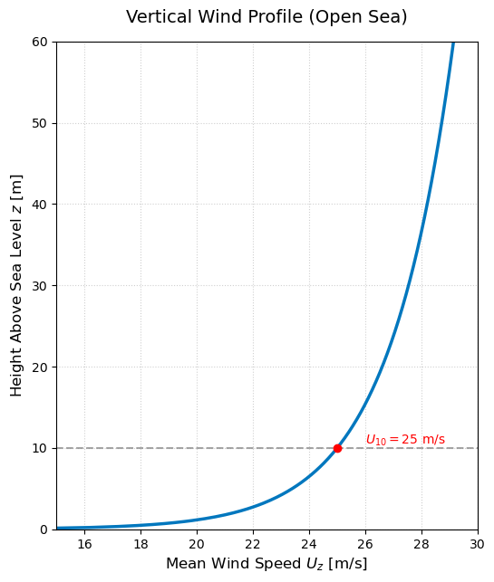

# Wind

While floating and submerged tunnels are primarily influenced by hydrodynamic forcing, the aerodynamic environment can play a critical, dual role in their design. First, wind acts on the surface components (pontoons, towers, and bridge girders), creating static and dynamic loads. Second, wind is the driving force behind wave generation; understanding the wind field is essential for predicting the "fetch-limited" sea states described in the JONSWAP spectrum (see Section Waves).

## Mean Wind Speed and Profile ($U_z$)

Wind speed is not uniform in the vertical direction; it increases with height above the sea surface. This variation is caused by the friction between the moving air and the water surface.

The reference wind speed is traditionally defined at a standard height of 10 meters ($U_{10}$). However, structural components often extend well above or sit slightly below this level. To determine the design wind speed ($U_z$) at a specific elevation ($z$), engineers use mathematical models such as the **Logarithmic Law** or the **Power Law**. These models extrapolate the speed from the reference height, accounting for the "roughness" of the sea surface.

### Why is the vertical profile important for floating structures?

Assuming a constant wind speed across the entire height of a structure can lead to significant errors in design calculations. The vertical profile is particularly impactful for floating tunnel concepts for the following reasons:

- **Tall Surface Elements:** Floating tunnels often feature ventilation towers, suspension pylons (if combined with a bridge), or high-freeboard pontoons. The top of a ventilation tower will experience significantly higher wind velocities than its base near the water.
- **Overturning Moments:** Because wind speed—and therefore wind pressure—increases with height, the center of aerodynamic force is pushed upwards. This creates a larger lever arm, resulting in higher overturning moments that the floating foundation and mooring system must counteract.
- **Force Estimation on Pontoons:** Even for low-profile pontoons, the wind speed very close to the water surface (where friction is highest) may be lower than $U_{10}$. Using the correct profile ensures that drag forces on the hull are not overestimated, or conversely, that forces on superstructures are not underestimated.
