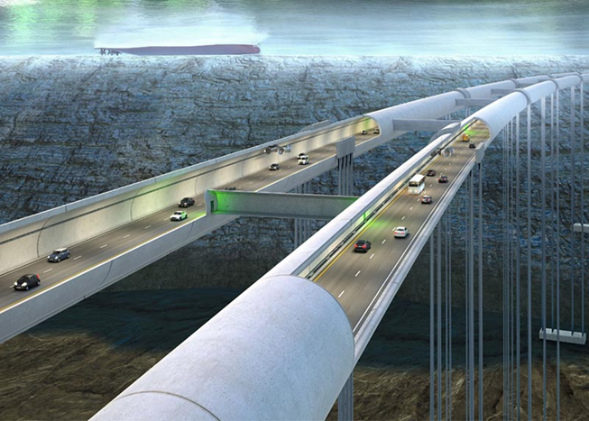

# Course Introduction

The Floating and Submerged Structures course let’s you imagine a future, and specifically a future submerged structure, and let you experience a project where you are tasked to design such a structure. You will get the in-depth capability to achieve that.

  |  
:-------------------------:|:---------------------------:
Floating Tunnel             |  Hydrodynamics Around a Floating Tunnel

With the capabilities you attain in this course you have a lot of the essential tools to design Offshore floating and submerged structures. We have put a few examples here, but the designs in the near future will be much more promosing!

## Learning Objectives
These are the learning objectives in this course. Key points:
How do you develop and calculate a concept design?
You should be able to determine loads and understand the dynamics.
You will have to know how to consider various life-cycle stages
You will be able to assess the reliability of the design
You will know how to incorporate ethical and stakeholder aspects.

We do this in a project environment and provide tools and considerations which we have extracted from experience in the industry. As such you will work the 9-week period as if you have an actual concept design assignment.

- Create conceptual solutions of floating and submerged structures, with understanding of the basic physical background of the design formulae and methods for different floating and submerged solutions.
- Determine the loads on floating and submerged structures, including dynamic interactions using measured data of the environmental conditions.
-   Assess the influence of different life-cycle aspects, including construction and installation, on different solutions of floating and submerged structures.
- Communicate quantified uncertainties in models and designs of floating and submerged structures, including model-scale testing, design philosophy and safety.
- Propose new ways for dealing with ethical issues within the field of floating and submerged structures from the perspective of different relevant moral frameworks.
- Conduct a solution-oriented debate with stakeholders about ethical issues within the field of floating and submerged, while acknowledging real-world constraints in terms of technological possibilities, governance and institutional options.

## Course Approach
The course has the following elements as shown here:

- Provide framework for individual concept development
- Lectures on approaches and considerations
- Recap on environmental considerations and loads, hydrostatic and hydrodynamic analysis.
- Lectures on advanced hydrodynamic considerations
- Group exercise on concept development
- Individual concept development, life-cycle assessment, modeling, analysis and risk assessment
- Group exercise on stakeholder review 
- Coaching and support from lecturers

## Planning

The planning is such that it is front loaded. *What does that mean?* It means that we start today in earnest. You will get a lot of theory in the first 4 to 5 weeks, but similar to project work in real life, you will also have to start working your concept as soon as possible. Reason is that over the duration of the course you will have to go deeper and deeper in working out your design. If you start too slow, you will not have the benefit to go deep enough and/or be able to assess what you have designed well enough. 

The concept choice should be made by week 3, we have a feedback session midway and in week 8 you will have to issue a report as a team. In week 9 we have oral exams. There are three routes indicated, the yellow route in the Numerical Analysis route which is also given by Oriol, the blue route is the reliability or probabilistic design route given by Patricia & Oswaldo. Both tracks are fully incorporated in your concept design. The green route involves the concept design route and includes a stakeholder debate in week 7.

We have included milestone deliverables at distinct times. 
The timings are given in a separate document on Bright space. 

## Following Topics
What to expect in this chapter:
1. In first instance we will take a step back or out to view several trends towards the future, items we can discuss but may be a context for envisioning future requirements.
2. Then we will highlight project approach basics which could help your thinking now and in future situations.
3. Project Teams will organize typically consist of 3 to 4 people, the team with which you will work this course, and start developing various concepts. 
4. You will have to determine the environmental conditions at your location.
5. We will provide guidance on how to develop a concept, which you could use.
6. This week we will also have a lecture on life-cycle aspects.

This provides an overview of the course and what we will do this week. 

## Floating and Submerged Concepts

::::{tab-set}

:::{tab-item} Floating Islands
:sync: floating-islands

  
Artificial floating islands can revitalize aquatic dead zones, providing habitats for marine organisms and improving water quality.  
Source: [Wired](https://www.wired.com/gallery/stfloatingislands)
:::

:::{tab-item} Floating Breakwaters
:sync: floating-breakwaters

Floating breakwaters are structures designed to protect shorelines and harbors by dissipating wave energy.  
Source: [Alamy](https://www.alamy.com/stock-photo/floating-breakwater.html)
:::

:::{tab-item} Floating Tunnels
:sync: floating-tunnels

Submerged floating tunnels are innovative concepts for crossing deep water bodies, suspended by pontoons or anchored to the seabed.  
Source: [Adobe Stock](https://stock.adobe.com/search?k=underwater+tunnel)
:::

:::{tab-item} Floating Bridges
:sync: floating-bridges

Floating bridges, or pontoon bridges, are supported by floating pontoons and are used where traditional bridges are impractical.  
Source: [iStock](https://www.istockphoto.com/photos/floating-bridge)
:::

:::{tab-item} Floating Solar
:sync: floating-solar

Floating solar panels are installed on water bodies, optimizing land use and reducing water evaporation.  
Source: [Adobe Stock](https://stock.adobe.com/search?k=floating+solar)
:::

:::{tab-item} Floating Wind
:sync: floating-wind

Floating offshore wind turbines harness wind energy in deep waters where fixed foundations are not feasible.  
Source: [Unsplash](https://unsplash.com/s/photos/offshore-wind)
:::

:::{tab-item} Submerged Tunnels
:sync: submerged-tunnels

Submerged tunnels are constructed beneath water bodies to facilitate transportation without disrupting surface activities.  
Source: [Adobe Stock](https://stock.adobe.com/search?k=%22underwater+tunnel%22)
:::

:::{tab-item} Submerged Cities
:sync: submerged-cities

Submerged cities are areas that have been overtaken by water, often due to natural disasters or rising sea levels.  
Source: [iStock](https://www.istockphoto.com/photos/underwater-city)
:::

:::{tab-item} Submerged Pipelines
:sync: submerged-pipelines

Submerged pipelines transport fluids like oil and gas across water bodies, requiring specialized engineering.  
Source: [iStock](https://www.istockphoto.com/photos/underwater-pipeline)
:::

:::{tab-item} Submerged Current Power Systems
:sync: submerged-current-power

Underwater turbines harness kinetic energy from water currents to generate electricity.  
Source: [Getty Images](https://www.gettyimages.com/photos/underwater-current)
:::

:::{tab-item} Submerged Artificial Reefs
:sync: submerged-artificial-reefs

Artificial reefs are man-made structures placed underwater to promote marine life and biodiversity.  
Source: [USGS](https://www.usgs.gov/media/images/underwater-image-artificial-reef-structures-developed-university-miami-researchers)
:::

:::{tab-item} Cold Water Pipes
:sync: cold-water-pipes

Cold water pipes are used in various applications, including thermal energy extraction from deep water sources.  
Source: [Adobe Stock](https://stock.adobe.com/search/images?k=cold+water+pipe)
:::

:::{tab-item} Risers
:sync: risers

Risers are conduits that transfer materials from the seabed to production facilities on the surface.  
Source: [Getty Images](https://www.gettyimages.com/photos/offshore-riser)
:::

::::

