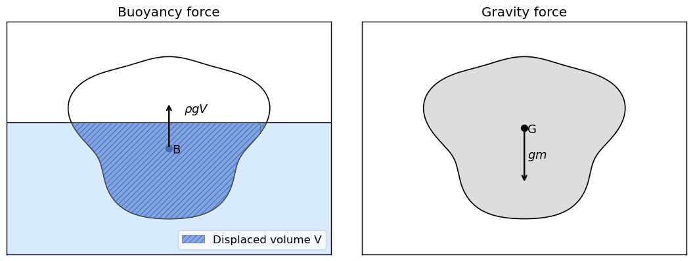

# Hydrostatic

<!-- We explore the hydrostatics of submerged cylindrical structures using a numerical approach. The goal is to understand how submerged bodies interact with fluid pressure fields and to calculate key parameters such as the forces acting on the body and its submerged depth (draft). This serves as a practical application of hydrostatics and numerical methods.

## Learning Objectives:
- Understand the interaction between submerged bodies and fluid pressure fields.
- Apply finite element concepts to model cylindrical structures.
- Use numerical methods to calculate forces and solve for equilibrium conditions.
- Visualize and interpret hydrostatic phenomena.
- This notebook provides a hands-on approach to learning hydrostatics and numerical modeling, making it an excellent tool for understanding the principles of fluid-structure interaction. -->

Hydrostatic loads arise from the pressure field generated by water at rest. These loads govern the buoyancy, equilibrium position, and stability characteristics of floating and submerged structures.

Hydrostatic loading consists of three fundamental components:
1. **Hydrostatic pressure**
2. **Buoyancy**
3. **Static floating stability**

The following sections present these three concepts.

## Hydrostatic Pressure
The hydrostatic pressure can be described as the weight of the fluid column above the point at which that pressure is measured.

In a static fluid, pressure varies with depth according to:

$$
p(z) = p_0 + \rho g z 
$$

where:

- $p_0$ = pressure at the free surface (usually atmospheric), 
- $\rho$ = water density, 
- $z$ = depth below the free surface.

Hydrostatic pressure acts normal to the surface and generates compressive stresses on hulls, walls, and submerged components. The pressure is typically expressed as a relative pressure, meaning the reference pressure at the free surface is taken as zero. In that case:

$$
p(z) = \rho g z 
$$

which simplifies the formulation without changing any resulting forces. Only pressure differences matter for hydrostatic loading, so the absolute value of $p_0$ does not affect the net hydrostatic force on a structure.

<!-- <iframe src="../../../figures/mooring_position.html" width="1200" height="600" frameborder="0"></iframe>  TODO Add figure from lecture slides -->

## Archimedes’ Principle and Buoyancy

When a body is submerged (fully or partially), the surrounding water exerts a net upward force known as buoyancy. According to Archimedes’ Principle:

_"The buoyant force equals the weight of the displaced fluid."_

Mathematically, a body submerged in a fluid experiences an upward buoyant force, $F_B$ equal to:

$$
F_B = \rho g V
$$

With:

- $\rho$ = mass density of the fluid
- $g$ = gravity acceleration constant
- $V$ = Volume of the submerged part of the body

The resulting buoyant force is the vertical component of the hydrostatic pressure integral over the surface of the body: 

$$
F_B = \left( \int_S p_h \,\vec{\mathbf{n}}_S \, dS \right) \cdot \vec{\mathbf{n}}_z
$$

<!-- TODO Add exercise from slides here here -->

## Static floating stability

A floating structure is in static equilibrium when the resultant of all forces and the resultant moment about any axis are equal to zero. When the structure is slightly disturbed from this position, its behaviour defines its type of stability:
- Stable equilibrium:
A small disturbance produces a restoring effect that moves the structure back toward its original position.
- Neutral equilibirum: 
After a disturbance, the structure remains in its new position, without returning or moving further away.
- Unstable equilibrium:
A disturbance causes the structure to move farther away from its original position because no restoring tendency is present.

Static stability can be considered separately for vertical translation, horizontal translation, and rotation.

### Vertical equilibrium
A small vertical displacement changes the submerged volume and therefore the buoyant force. If the body moves downward, the increased displaced volume produces a larger upward force that tends to restore the original position. If the body moves upward, the opposite occurs. This mechanism results in stable equilibrium in the vertical direction.

In equilibrium, the buoyant force exactly balances the weight:

$$
F_B = W
$$

Which can be rewritten to:

$$
\rho g V = g m 
$$

This mechanism creates a restoring effect, meaning floating structures are always in stable equilibrium in the vertical direction.



### Horizontal equilibirum 
A small horizontal translation does not change the submerged geometry or the hydrostatic pressure distribution. Because the pressure field remains symmetric, the net hydrostatic force in the horizontal direction remains zero. The structure is therefore in neutral equilibrium for horizontal displacement, unless external systems (e.g., moorings, currents) introduce restoring or destabilizing forces.

### Rotational equilibrium

A small rotation changes the submerged geometry in an asymmetric way, causing the center of buoyancy $B$ to shift laterally relative to the center of gravity $G$. 

A small rotation causes the submerged geometry of the structure to change asymmetrically. This shifts the center of buoyancy $B$ sideways relative to the center of gravity $G$. This creates a horizontal offset $y$ between the buoyant force and the weight, which creates a moment.

The magnitude of this hydrostatic moment can be expressed as:

$$
M_H = \rho g V \cdot y = gm \cdot y
$$

The value and direction of this moment determine the type of rotational stability:
- If $M_H$ acts against the rotation (restoring moment), the structure tends to return to its upright position. In this case, the rotational equilibrium is stable.
- If $M_H = 0$, no restoring or overturning effect is generated, resulting in a neutral rotational equilibrium. <!-- I think this is an error in the slides -> should be neutral not stable -->
- If $M_H$ acts in the same direction as the rotation (overturning moment), the structure becomes increasingly tilted and the equilibrium is unstable.


<!-- The figure illustrates how a small disturbance of a floating body creates a horizontal separation between the lines of action of weight (acting through $G$) and buoyancy (acting through $B$). This horizontal distance $y$ generates a hydrostatic moment $M_H$. In the sketched situation the body is heeled slightly clockwise, representing the small disturbance. Play with the interactive plot to see the type of stability that occurs.  # Description for the figure-->

``` {raw} html
<iframe
  src="../../../_static/widgets/rotational_stability.html"
  width="100%" height="520" style="border:0" loading="lazy">
</iframe>
```