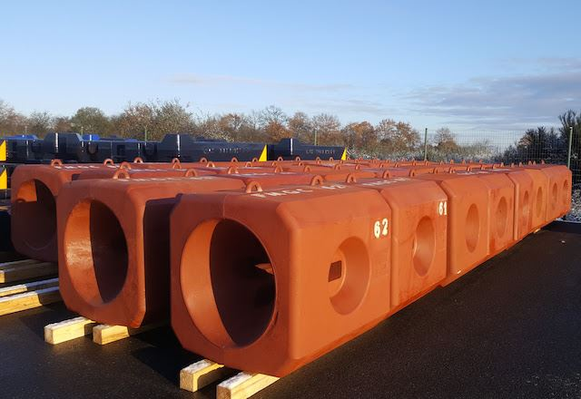
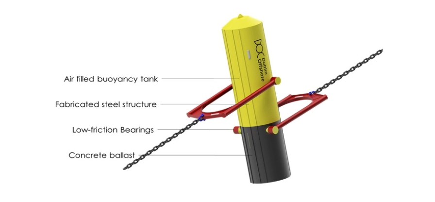
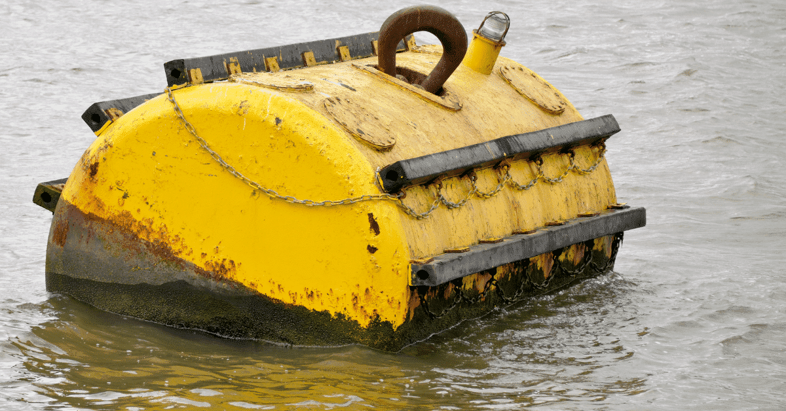
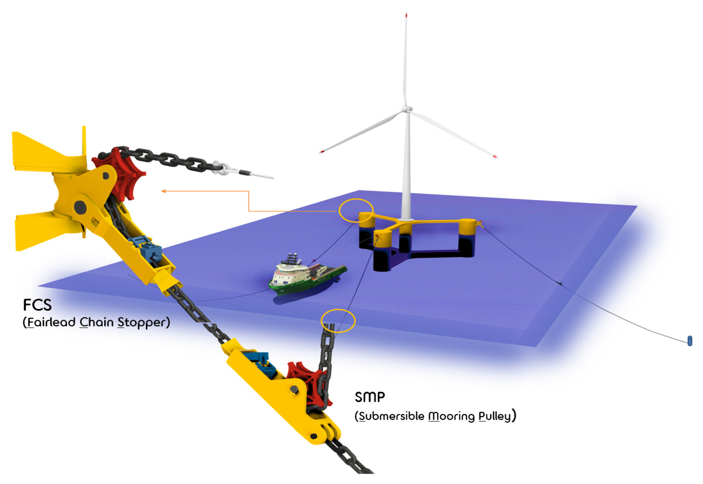

# Jewelry

With Jewelry we refer to all connectors, attachments, or accessories needed to attach or connect mooring or segments of the mooring line.

| Component                  | Purpose | Image |
|-----------------------------|---------|-------|
| **Clump weights**           | Heavy weights attached to the line to increase restoring force, reduce line angles, or improve station-keeping by adding pretension. |  |
| **In-line tensioners**      | Devices installed along the mooring line to adjust or maintain the desired pretension and compensate for line elongation over time. |  |
| **Load reduction devices**  | Specialized elements that absorb or limit peak dynamic loads in the mooring system, improving fatigue life and protecting the floater. |  |
| **Mid-line buoyancy elements** | Buoys attached along the mooring line to alter its profile, reduce seabed interaction, or modify restoring stiffness. |  |
| **Pull-in Connector**       | Connectors used to attach the mooring line to the floater during installation and allow for easier retrieval or disconnection. |  |
| **Intermediate line connectors** | Hardware used to join two different mooring line segments, often between chains, wires, or synthetic ropes. | |
| **Mooring winches**         | Deck-mounted or subsea devices used to install, adjust, or retrieve mooring lines by controlling line length and tension. | |
| **Fairleads**               | Guide structures mounted on the floater to lead mooring lines from the deck machinery to the water, reducing abrasion and bending stresses. | |

