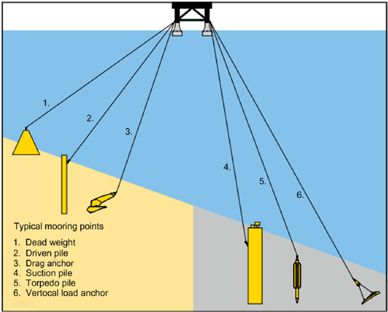

# Mooring System Design

## 1. Introduction to Mooring System Design


Mooring systems are critical for maintaining the position of floating and submerged offshore structures, such as platforms, wind turbines, and subsea equipment. Their design must ensure stability under varying environmental loads from wind, waves, and currents. Key considerations include structural behavior, operational reliability, and long-term durability. Environmental conditions define load extremes, while operational needs dictate motion limits and functionality. Cost-effectiveness is essential, balancing material choice, installation complexity, and maintenance.

**Figure 1:  Classic floating wind platform concepts that include spar (left), semisubmersible (center), and tension leg platforms (right).**  
  
*Reference: [Josh Bauer, NREL ](https://www.nrel.gov/news/program/2020/nrel-floats-new-offshore-wind-cost-optimization-tool.html)*

> 💭 **What makes a mooring system “good”?**
> - *How do we balance the need for a mooring system to minimize movement during regular operations with its ability to survive extreme environmental conditions?*
> - *Considering the long-term perspective, what design choices in a mooring system have the biggest impact on its inspection, maintenance, and potential failure risk?*
> - *Given that a single mooring system must perform under a range of conditions, what are the most critical trade-offs to consider between a "stiff" system and a more "compliant" one?*
---

### 1.1. Purpose of Mooring System Design

Different structures have vastly different demands. A temporary mooring for a supply ship has lighter requirements than a permanent mooring for an FPSO (Floating Production, Storage and Offloading). Understanding *why* you need a mooring is the first step to deciding *which* mooring approach fits.

A **mooring system** is defined as the complete setup of interconnected lines, connections, and anchor points between one (or several) floating and/or submerged body(-ies) and the seabed or other fixed points. Its main purposes include:

1. Keeping the body or bodies within a predefined area (or volume).  
2. Limiting (second-order) motions.  
3. Controlling structural displacements within and between bodies.  

### 1.2. Common Types of Moorings

1. **Temporary or Permanent**

   *Temporary moorings * are typically used for short-term operations.

   *Permanent moorings * are designed for long-term deployment (e.g., floating platforms, FPSOs).

2. **Catenary & Taut (Spread) Mooring**

   *Catenary mooring * relies on the weight of the mooring line to provide restoring force.

   *Taut mooring * uses more vertical tension to hold position with a reduced horizontal footprint.

3. **Single Point Mooring (SPM)**

   Often includes turret-based systems allowing a vessel to weathervane around a *single mooring point *.

4. **Tension Leg Mooring**

   Used in *Tension Leg Platforms (TLP) *, providing high vertical stiffness and minimal vertical motion.

5. **Wish-bone Systems**

   A specialized configuration with two symmetrical lines forming a “Y” shape: *Wish-bone *.

6. **Intermediate Moorings**

   Additional mooring lines or points placed between the main anchor and floater to improve stability.  
   

7. **Dynamic Positioning**

   Actively controlled thrusters maintain position, often in tandem with a mooring assist in harsh conditions.  
   
---

## 2. Components
Chains, wire ropes, synthetic lines—each has trade-offs in terms of strength, flexibility, corrosion resistance, and cost. Connectors, such as shackles and fairleads, form the critical links (literally) between segments

A mooring system consists of several key components:

- **[Foundations](https://en.wikipedia.org/wiki/Offshore_embedded_anchors)**  
- **Connection elements** (chains, wires, connectors)  
- **Floaters and their attachments** (fairleads, winches, etc.)

---

### 2.1 Foundations

Mooring lines aren’t much use without a secure anchor point. Anchors, piles, or suction caissons must be chosen according to seabed properties (clay, sand, rocky terrain) and load requirements. An anchor designed for soft clay might underperform in a rocky seabed.

Mooring foundations transfer loads from the mooring lines into the seabed. Common foundation types include:


1. **Gravity Anchor**  
   - Relies on its own weight to resist loads.  
   - Can be cumbersome for installation or removal if very large.

2. **Driven Pile**  
   - Offers high capacity for both vertical and horizontal loads in a wide range of soil conditions.  
   - Typically installed by impact driving (noise concerns).  
   - Not easily removed.

3. **Drag Anchor**  
   - Most efficient in cohesive soils (though also used in sands).  
   - Provides primarily horizontal capacity.  
   - Easy to install and remove.

4. **Suction Pile**  
   - Uses differential pressure to embed into the seabed; suited for certain soil types.  
   - Offers high horizontal capacity; vertical capacity depends on soil conditions.  
   - Generally easy to install and remove.

5. **Torpedo Pile**  
   - Deployed by free-fall, penetrating the seabed via kinetic energy.  
   - Common in deep water, soft to medium clay conditions.  
   - Provides both vertical and horizontal capacity.

6. **Vertical Load Anchor**  
   - Ideal for layered soft clays; provides horizontal and vertical capacity.  
   - Easy installation and removal.

**Figure 1 – Foundation Types**  
  
*Reference: [Mooring System Engineering for Offshore Structures](https://www.sciencedirect.com/book/9780128185513/mooring-system-engineering-for-offshore-structures)*

**Figure 2 – Foundations and their respective depths**  
  
*Reference: [Anchor geotechnics for floating offshore wind: Current technologies and future innovations](http://dx.doi.org/10.1016/j.oceaneng.2023.114327)*

#### Example Foundation Parameters for Floating Wind

- **Driven Pile**: Diameters up to 12 m, L/D up to 60, Horizontal & Vertical efficiency ~12–100 (Force/Mass).  
- **Drag Anchor**: Ultimate Holding Capacity (UHC) for a 30 mT Stevpris Mk5 can be ~1700 mT in sand/hard clay[^1], Horizontal efficiency ~30–300.  
- **Suction Pile**: Diameter ≤16 m, L/D ≤1 (sand) or 8 (clay), Horizontal efficiency ~50–250, Vertical ~9–100.

[^1]: Reference: *Vryhof Anchor Manual*.

---

<a name="connection-foundation-to-floater"></a>
### 2.2 Connection Foundation to Floater

- **Chain (Studless, Studlink)**  
  - Offers robust and flexible connections.  
  - High weight and good wear resistance.

- **Steel Spiral Strand Wire Rope**  
  - Lighter than chain.  
  - More prone to corrosion; higher cost.

- **Synthetic Wire Rope**  
  - Materials: Polyester, Nylon, HMPE (High Modulus PolyEthylene), Aramid.  
  - High strength, low submerged weight.  
  - Cost-efficient relative to steel wire in terms of strength/weight ratio.  
  - Fatigue-resistant for tension cycling.  
  - Subject to **visco-elastic behavior** (stiffness depends on load rate and temperature).  

```{note}
Design/analysis of fiber ropes often follow [DNV-RP-E305](https://rules.dnv.com/docs/pdf/DNV/en/standards/RP-E305.pdf) guidelines, considering upper and lower bound stiffness in mooring calculations.
```

**Floater Attachments**  
- **Fairleads / Hull Connection**: Guides mooring lines from the floater.  
- **Mooring Winches**: Tension control and line adjustment.  
- **Connector Systems**: In-line tensioners, pull-in connectors, intermediate line connectors.

---

<a name="system-approaches"></a>
## 1.3 System Approaches

A mooring system often combines several single-line moorings or a grid-based approach to form a **restoring system**. Common examples:

1. **Multi-Line Mooring System**  
   

2. **Body-to-Body Line Systems**  
   

3. **Wishbone System**  
   

4. **Tension Leg System**  
   

Each configuration has its own advantages based on site conditions, project requirements, and cost considerations.

---

<a name="catenary-equation"></a>
## 1.4 Catenary Systems

Heavy chain or cable rests partly on the seafloor, forming a classic “catenary” curve that resists horizontal movement by geometry alone. Effective for moderate water depths, but can require plenty of line length—and plenty of sea space.

> **Derivation of the Catenary Equation without stretch**  
> <details>
> <summary>Click to expand the simplified catenary formula derivation!</summary>
> 
> This derivation is taken from **OE44100: Floating Structures & Offshore Moorings by Sebastian Schreier**, in which the catenary equation is derived for a line/chain under its own weight (in water). Here, we aim for the simplified form *without* stretch, assuming no wave/current loads.
> 
> ---
> 
> ### 1. Elemental Forces & Assumptions
> We consider the following mooring element:
>
>
>
> The element is part of a larger heavy mooring chain. The forces along the element are as follows (with simplifications):
> 1. **Horizontal Force Balance** in &#8594; $x$-direction: $$F_{x,i}+dF_x-F_{x,i}=0$$ 
>    Because no external horizontal forces are assumed, the horizontal component of tension 
>    $F_x$ remains **constant** along the line ($dF_x = 0$), which simplifies the equation as follows:
>    $$
>    F_{x,i+1} - F_{x,i} = 0 \quad \Rightarrow \quad F_x = \text{constant}.
>    $$
> 
> 2. **Vertical Force Balance** in &#8593; $y$-direction: $$F_{z,i}+dF_z-dm \cdot g + dF_B - F_{z,i} = 0 $$  
>    A small element $ds$ of the mooring line must support its *weight in water*:
>    $$
>    dF_z = w \, ds,
>    $$
>    where $w$ is the *submerged* weight per unit length,
>    $$
>    w = \left(1 - \frac{\rho_w}{\rho_s}\right)\mu g \quad (\text{constant along the line}),
>    $$
>    with $\mu$ = mass per unit length (in air), and $\rho_w, \rho_s$ the water and line densities, 
>    respectively.
> 
> 3. **Geometry (Slope Relationship)**  
>    By Pythagoras:
>    $$
>    ds = \sqrt{dx^2 + dz^2} = \sqrt{1 + \Bigl(\frac{dz}{dx}\Bigr)^2}\,dx.
>    $$
>    If we denote the tension’s *vertical* component by $F_z$, then near any point
>    $$
>    \frac{dz}{dx} = \frac{F_z}{F_x},
>    $$
>    because the line is flexible (no bending stiffness) and tension acts tangentially.
> 
> ---
> 
> ### 2. Setting Up the Differential Equation
> 
> From the vertical balance $dF_z = w\,ds$, we get:
> $$
> \frac{dF_z}{dx} \;=\; \frac{dF_z}{ds}\,\frac{ds}{dx} 
> \;=\; w\,\sqrt{\,1 + \Bigl(\frac{dz}{dx}\Bigr)^2}.
> $$
> But $F_z = F_x\,\tfrac{dz}{dx}$, so
> $$
> \frac{dF_z}{dx} 
> = \frac{d}{dx}\Bigl(F_x \,\frac{dz}{dx}\Bigr)
> = F_x \,\frac{d^2 z}{dx^2}.
> $$
> Thus,
> $$
> F_x\,\frac{d^2 z}{dx^2}
> = w\,\sqrt{\,1 + \Bigl(\frac{dz}{dx}\Bigr)^2}.
> $$
> 
> **Substitution**: let
> $$
> p = \frac{dz}{dx}.
> $$
> Then $\tfrac{d^2 z}{dx^2} = \tfrac{dp}{dx}$. The equation becomes
> $$
> F_x\,\frac{dp}{dx} = w \,\sqrt{1 + p^2}.
> $$
> Rearrange:
> $$
> \frac{dp}{\sqrt{1 + p^2}}
> = \frac{w}{\,F_x\,}\,dx.
> $$
> 
> ---
> 
> ### 3. First Integration: Slope
> 
> Integrate both sides:
> $$
> \int \frac{dp}{\sqrt{1+p^2}} 
> = \int \frac{w}{\,F_x\,}\,dx
> \quad\Longrightarrow\quad
> \sinh^{-1}(p)
> = \frac{w}{F_x}\,x + C_1.
> $$
> Hence,
> $$
> p \;=\; \frac{dz}{dx}
> = \sinh\Bigl(\frac{w}{F_x}\,x + C_1\Bigr).
> $$
> 
> ---
> 
> ### 4. Second Integration: Shape
> 
> Integrate once more:
> $$
> z(x)
> = \int \sinh\Bigl(\tfrac{w}{F_x} x + C_1\Bigr)\,dx.
> $$
> Recall $\int \sinh(ax+b)\,dx = \frac{1}{a}\cosh(ax+b) + \text{const}$. Thus,
> $$
> z(x)
> = \frac{F_x}{\,w\,}\;\cosh\Bigl(\tfrac{w}{F_x}x + C_1\Bigr) + C_2.
> $$
> 
> **Boundary Conditions**:  
> Typically, we set the anchor (touch-down) at $x=0$, $z=0$, and require **no vertical tension** there: 
> $$
> F_z(0) = F_x\,\left.\frac{dz}{dx}\right\vert_{x=0} = 0 
> \;\;\Rightarrow\;\; \sinh(C_1) = 0 \;\;\Rightarrow\;\; C_1 = 0.
> $$
> Then $z(0)=0$ gives:
> $$
> 0 = \frac{F_x}{\,w\,}\cosh(0) + C_2 
> \;\;\Longrightarrow\;\; C_2 = -\frac{F_x}{w}.
> $$
> 
> **Final Form**:
> $$
> \boxed{
> z(x)
> = \frac{F_x}{\,w\,}\Bigl[\cosh\Bigl(\tfrac{w}{F_x}\,x\Bigr) - 1\Bigr].
> }
> $$
> 
> This is the classic *no-stretch catenary equation* for a chain of weight $w$ per unit length, with horizontal tension $F_x$ at the anchor and reference $(x,z)=(0,0)$.
> 
> ---
> 
> ### 5. Key Observations
> 
> - **Horizontal Tension** $F_x$ is constant (no horizontal external loads).
> - **Vertical Tension** $F_z$ at a distance $x$ is $F_z = F_x\,\sinh(\tfrac{w}{F_x} x)$. 
> - **Top Tension** is highest at the fairlead because it supports the entire suspended line weight.
> - **Seabed Contact**: part of the chain may lie on the seabed if the total chain length is larger than the suspended length. 
> - This simplified approach is a great first estimate for mooring designs.
> 
> </details>

<a name="tension-leg"></a>
## 1.5 Tension Leg Mooring System

Near-vertical tension legs keep platforms in place by relying on buoyancy. With minimal vertical motion (heave), tension leg systems excel for TLPs (Tension Leg Platforms) in deeper water but involve higher complexity and cost.

<a name="loading"></a>
## 1.6 Loading

The ocean can be calm one moment and a tempest the next. Mooring systems must handle waves, wind gusts, strong currents, and potential drag from risers or installed equipment. Designing for the *extreme* ensures long-term reliability.

<a name="concept-design"></a>
## 1.7 Concept Design & Regulations

Industry codes (API, ISO, classification societies) specify standards for factor-of-safety, fatigue life, and material integrity. A concept design must align with these guidelines while addressing project-specific constraints.

<a name="costs"></a>
## 1.8 Costs

Material selection, installation vessel day rates, and ongoing maintenance can all shape the final price tag. A designer’s mission is to optimize for durability, safety, and operational needs—without breaking the bank.


---

