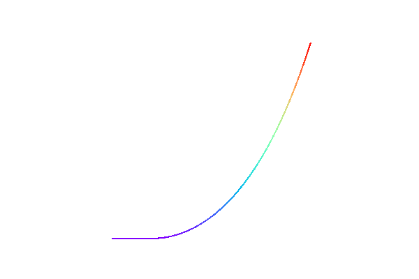

# Introduction to Mooring System Design



Mooring systems are critical for maintaining the position of floating and submerged offshore structures, such as platforms, wind turbines, and subsea equipment. Their design must ensure stability under varying environmental loads from wind, waves, and currents. Key considerations include structural behavior, operational reliability, and long-term durability. Environmental conditions define load extremes, while operational needs dictate motion limits and functionality. Cost-effectiveness is essential, balancing material choice, installation complexity, and maintenance.

```{figure} figures/floating_structures.png
---
name: fig-moored-FOWT-types
link: https://www.nrel.gov/news/program/2020/nrel-floats-new-offshore-wind-cost-optimization-tool.html
---
Classic floating wind platform concepts that include spar (left), semisubmersible (center), and tension leg platforms (right).  
Source: [Josh Bauer, NREL ](https://www.nrel.gov/news/program/2020/nrel-floats-new-offshore-wind-cost-optimization-tool.html)
```

```{note}
> 💭 **What makes a mooring system “good”?**
> - *How do we balance the need for a mooring system to minimize movement during regular operations with its ability to survive extreme environmental conditions?*
> - *Considering the long-term perspective, what design choices in a mooring system have the biggest impact on its inspection, maintenance, and potential failure risk?*
> - *Given that a single mooring system must perform under a range of conditions, what are the most critical trade-offs to consider between a "stiff" system and a more "compliant" one?*
```

---

## Purpose of Mooring System Design

Different structures have vastly different demands. A temporary mooring for a supply ship has lighter requirements than a permanent mooring for an FPSO (Floating Production, Storage and Offloading). Understanding *why* you need a mooring is the first step to deciding *which* mooring approach fits.

A **mooring system** is defined as the complete setup of interconnected lines, connections, and anchor points between one (or several) floating and/or submerged body(-ies) and the seabed or other fixed points. Its main purposes include:

Often a mooring is used to connect a single floater to the seabed but sometimes it can be just the connection between two freely floating bodies. Key thought of this definition is to be aware that there can be multiple connections which should all be considered when designing a system. Reason is that they form an intricate dynamic system of masses and stiffnesses.  

1. Keep the bodies within a pre-defined area. Most likely these are areas in the waterline but thinking of a submerged structure it could also be a volume.  
2. Limit the motions. First order motions caused by waves on floaters, such as heave, roll, & pitch, are very difficult to restrain using a mooring system but the mooring can be used to restrain or take account of second order motions such as surge, sway or yaw.    
3. Limit the structural displacements within the bodies. In some cases an elongated structure under influence of wave loading can be designed with a mooring system to limit internal structural displacement such as in a submerged tunnel or pipeline.  


::::{tab-set}

:::{tab-item} Floating Wind Turbines
:sync: tab1

```{figure} figures/image9.png
---
name: fig-floating-wind-options
---
Floating wind turbine platforms: Tension Leg, Barge, Semi-submersible, and Spar types. Each mooring and hull concept is suited to different water depths and cost-performance trade-offs.  
_Source: Acteon, "Floating Wind: What are the mooring options?" [Link](https://www.pinterest.com/pin/424112489894781933/)_
```
:::

:::{tab-item} Subsea Production & Mooring Layout
:sync: tab2

```{figure} figures/image7.png
---
name: fig-subsea-fps-layout
---
Overview of a deepwater field development: subsea wells connected to a floating production platform and FPSO via risers and umbilicals.  
_Source: Ships & Offshore Technology Blog, [Link](http://ships-offshore-technoz.blogspot.com/2010/08/fpso-turret-system-stability.html)_
```
:::

:::{tab-item} FPSO with Turret System
:sync: tab3

```{figure} figures/image8.png
---
name: fig-fpso-turret
---
Floating Production Storage and Offloading (FPSO) unit with turret mooring system, allowing continuous rotation and stable positioning in harsh environments.  
_Source: BW Offshore_
```
:::

:::{tab-item} Mooring Concepts (Sketch)
:sync: tab4

```{figure} figures/77a9543b-0c41-40c7-a20c-f8a41ca73b00.png
---
name: fig-mooring-sketch
---
Conceptual illustration of floating mooring configurations for wind and offshore assets, highlighting system geometry and seabed anchoring methods.  
_Source: Acteon_
```
:::

::::


## Common Types of Moorings

1. **Temporary or Permanent**

   *Temporary moorings * are typically used for short-term operations.

   *Permanent moorings * are designed for long-term deployment (e.g., floating platforms, FPSOs).

2. **Catenary & Taut (Spread) Mooring**

   *Catenary mooring * relies on the weight of the mooring line to provide restoring force.

   *Taut mooring * uses more vertical tension to hold position with a reduced horizontal footprint.

3. **Single Point Mooring (SPM)**

   Often includes turret-based systems allowing a vessel to weathervane around a *single mooring point *.

4. **Tension Leg Mooring**

   Used in *Tension Leg Platforms (TLP) *, providing high vertical stiffness and minimal vertical motion.

5. **Wish-bone Systems**

   A specialized configuration with two symmetrical lines forming a “Y” shape: *Wish-bone *.

6. **Intermediate Moorings**

   Additional mooring lines or points placed between the main anchor and floater to improve stability.  
   

7. **Dynamic Positioning**

   Actively controlled thrusters maintain position, often in tandem with a mooring assist in harsh conditions.  
   


